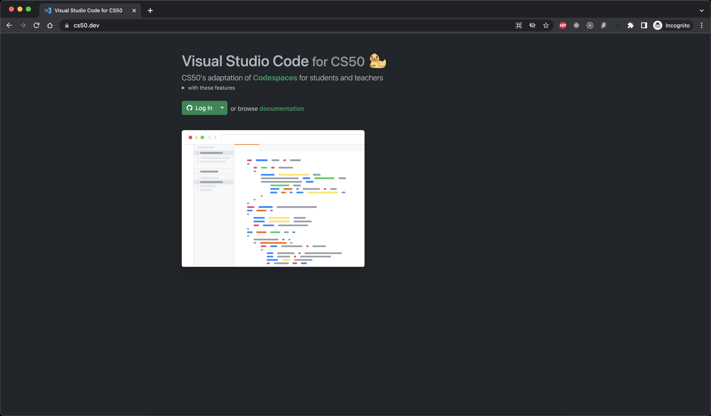

# CS50x Introduction to Computer Science

I made this repository to document my progress of Harvard University's CS50x course. Materials for the course in 2023 can be found <a href="https://cs50.harvard.edu/x/2023">here</a>. 

Over the course of 11 weeks it was a wholesome experience to have actively participated in CS50x course. The wide array of topics covered was vast but definitely helpful to continue learning computer science principles. Professor David Malan is one of the best instructors period! The coursework can be challenging but after a lot of practice and understanding it was worth the experience. I encourage all to enroll in this course. 

As of July 2023 here's my certificate of completion for CS50x. 

<h2><a href="https://cs50.harvard.edu/x/2023/honesty/">Academic Honesty</a></h2>

<h2><a href="https://cs50.me/cs50x">Gradebook</a></h2>

<h2><a href="https://cs50.dev">VSCode for CS50</a></h2>

